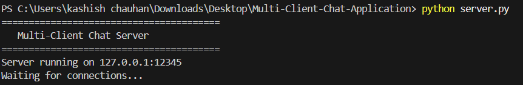
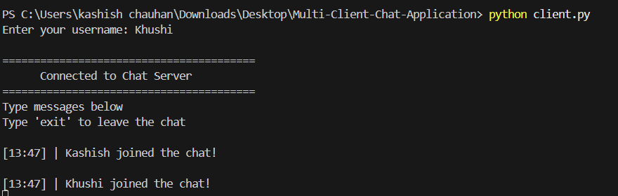
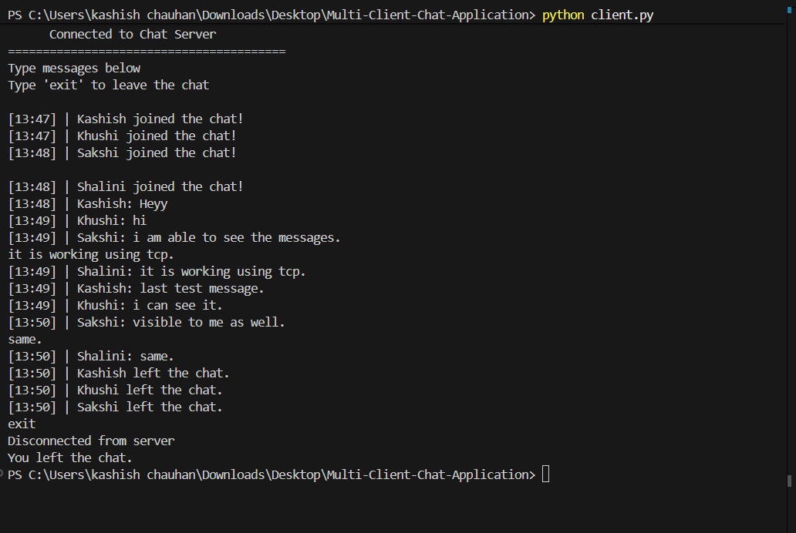

# Multi-Client Client-Server Chat Application

A real-time multi-client chat application developed using Python socket programming and threading. The project allows multiple users to communicate simultaneously through a centralized server using TCP/IP networking.

---

## Features

* Real-time messaging
* Multi-client support
* Username-based communication
* Join and leave notifications
* Message timestamps
* Chat history storage
* Concurrent client handling using threading
* Client-server architecture

---

## Technologies Used

* Python
* Socket Programming
* TCP/IP Networking
* Threading

---

## Project Structure

```text
multi-client-chat-app/
│
├── server.py
├── client.py
├── chat.txt
├── README.md
└── screenshots/
    ├── server_running.png
    ├── chat_demo.png
    └── Multiple_clients.png
```

---

## How It Works

* The server listens for incoming client connections.
* Clients connect to the server using a username.
* Messages sent by one client are broadcast to all connected users in real time.
* Each client runs on a separate thread for simultaneous communication.
* Chat history is stored locally in a text file.

---

## Screenshots

### Server Running


### Multiple Clients Connected


### Chat Demo



## Installation & Setup

### 1. Clone the Repository

```bash
git clone https://github.com/yourusername/multi-client-chat-app.git
```

---

### 2. Navigate to Project Directory

```bash
cd multi-client-chat-app
```

---

### 3. Start the Server

```bash
python server.py
```

---

### 4. Start the Client

Open another terminal window and run:

```bash
python client.py
```

You can open multiple client terminals to simulate multiple users.

---

## Example Output

```text
========================================
   Multi-Client Chat Server
========================================
Server running on 127.0.0.1:12345
Waiting for connections...
```

### Client Chat Example

```text
[14:32] | Kashish: Hello everyone
[14:33] | Khushi: Hi!
```

---

## Learning Outcomes

Through this project, the following concepts were explored and implemented:

* Client-server communication
* Real-time networking
* Socket programming
* Multi-threading
* TCP/IP protocols
* Concurrent client handling
* Message broadcasting systems

---

## Future Improvements

* Graphical User Interface (GUI)
* Private messaging
* Chat rooms/groups
* File sharing
* Database integration
* Encryption and secure communication

---

## Author

Kashish Chauhan
